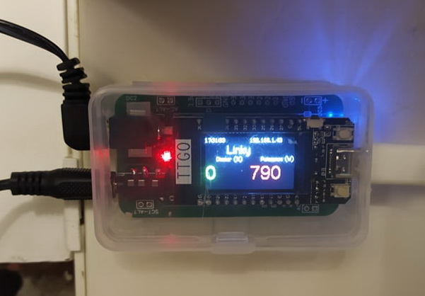
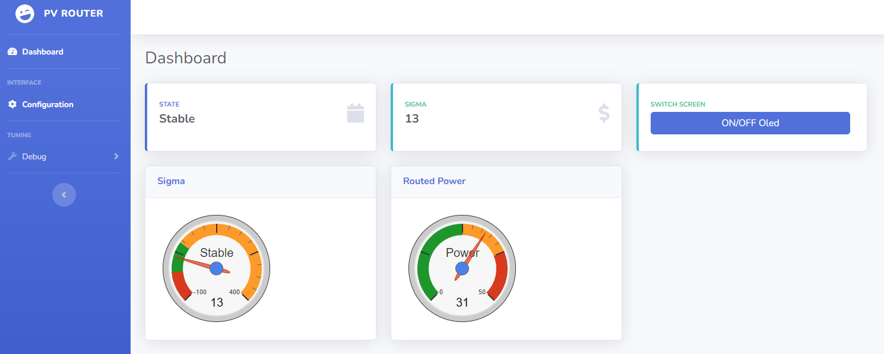
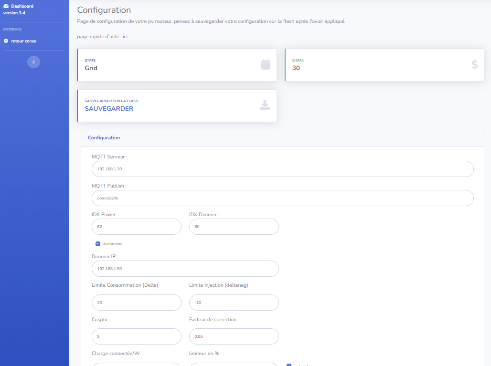
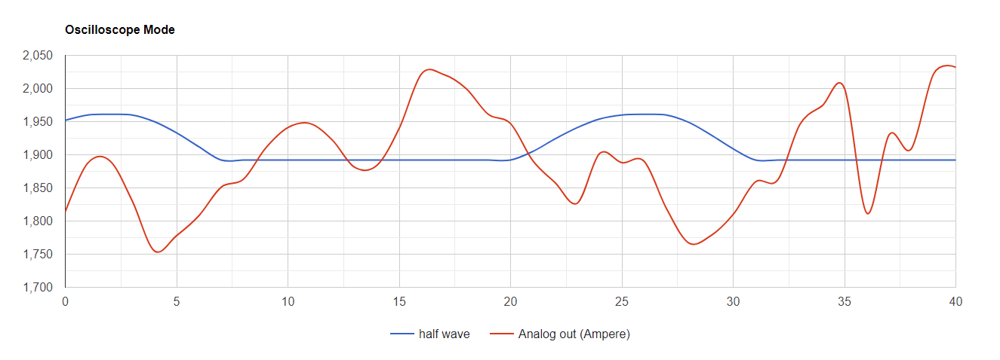

# Pv router Version 1.3 for ESP32 or TTGO T display 

# Photovoltaic router


# 01 - Install of  Visual Studio Code

To transfer the code to the microcontroller (ESP32 or TTGO) it is necessary to install[ Visual Studio Code](https://code.visualstudio.com/).

Once installed, you must install the [PlatformIO](https://platformio.org/install/ide?install=vscode) package which will be used later for all your projects and not only for the Dimmer or the Pv router.


# 02 - Copy or update repository sources

The sources are available on the Github (a code repository web server)

once your Visual Studio is launched, go to your Terminal and type

```shell
git clone https://github.com/xlyric/pv-router-esp32.git
```

it will then clone the repository on your machine and you can adapt the code to your needs and upload it.

[](https://pvrouteur.apper-solaire.org/uploads/images/gallery/2022-03/image-1648136080114.png)

you can then go to the directory created during the command

[](https://pvrouteur.apper-solaire.org/uploads/images/gallery/2022-03/image-1648136251752.png)

In the case of an update, you can update your code again with the following command

```shell
git pull
```

[](https://pvrouteur.apper-solaire.org/uploads/images/gallery/2022-03/image-1648136329142.png)

#### Default configuration

If you want to keep the router in access point mode, you don't have to do anything, just upload the code.

If you want to use it on your wifi network, you have to configure 1 file to operate the Router  
In the Data directory which contains the HTML pages, you must rename the file wifi.json.ori  
in wifi.json and enter the connection parameters of your internet box

# 03 -  USB code upload

Uploading is done with Visual Studio Code (VS) using the PlatformIO tab

[](https://pvrouteur.apper-solaire.org/uploads/images/gallery/2022-03/image-1648136519736.png)

During your 1st Upload, you must connect your TTGO or ESP32 to your PC with a USB cable

Thanks to VS you will load in the microcontroller the firmware and the HTML pages of the router

There are 2 uploads to do:

- one for the firmware (the system code)
- one for the filesystem (configuration files and website)


Then you can directly upload the code remotely with the /update page of the router

# 04 - Remote code upload

Uploading is done with Visual Studio Code (VS) using the PlatformIO tab

[](https://pvrouteur.apper-solaire.org/uploads/images/gallery/2022-03/image-1648136519736.png)

your code being already present on the router, you can now directly generate the binary files to be sent.  
In general, only the General Build is to be done.  
The Build Filesystem Image is only there to update the HTML pages when functionalities evolve.

[](https://pvrouteur.apper-solaire.org/uploads/images/gallery/2022-03/image-1648136931479.png)

once the build is done:

[](https://pvrouteur.apper-solaire.org/uploads/images/gallery/2022-03/image-1648137170040.png)

it shows where the firmware is.

all you have to do is connect with the internet browser on your pv router and go to the /update page

[](https://pvrouteur.apper-solaire.org/uploads/images/gallery/2022-03/image-1648137301517.png)

and upload the firmware

#### Case of a Filesystem update

In the case of updating the Filesystem ( HTML file ), it's the same procedure, you just have to take the Filesystem binary and select Filesystem.

Warning: before uploading it is important to check that the data/wifi.json file is present on your repository and contains the connection information to your internet box.

it is also preferable before the update to save its configuration by going to the /config.json web page and copy/paste the information into the config.json of your repository (or save it in a third-party file)

# 10 - Creation of the PV router with a TTGO-Tdisplay

The creation of the Pv router with the card adapted for the TTGO Tdisplay is currently the fastest

[](https://pvrouteur.apper-solaire.org/uploads/images/gallery/2022-03/image-1648140294690.jpg)

this card can be ordered from the [APPER association](https://www.helloasso.com/associations/apper/formulaires/4), and its purchase is considered a donation and therefore partially tax deductible.

The rest of the components can be ordered from various component suppliers. ([Aliexpress](https://fr.aliexpress.com/item/33048962331.html), [Amazon](https://amzn.to/3wyeFcy)...)

The display: TTGO Tdisplay

[](https://pvrouteur.apper-solaire.org/uploads/images/gallery/2022-03/image-1648139842187.png)

[Amazon](https://amzn.to/3wyeFcy)...

**the probe SCT013-30A**

[Amazon](https://amzn.to/3CtCHqi)

[](https://pvrouteur.apper-solaire.org/uploads/images/gallery/2022-03/image-1648139910136.png)

**A 12V recovery power supply**

\- You have to find an old 9-12V coil power supply in a drawer to convert it to AC power  
(or buy a power supply from [openenergymonitor.com](https://shop.openenergymonitor.com/ac-ac-power-supply-adapter-ac-voltage-sensor-euro-plug/))

[](https://pvrouteur.apper-solaire.org/uploads/images/gallery/2022-03/image-1648140231834.png)

12V AC power supplies as standard are very rare.

A classic USB power supply (1A max)

[](https://pvrouteur.apper-solaire.org/uploads/images/gallery/2022-03/image-1648140103860.png)

The card once mounted with the TTGO can be integrated into the box sold by the TTGO

[](https://pvrouteur.apper-solaire.org/uploads/images/gallery/2022-03/image-1648140379598.jpg)

to then be integrated into a table or other after uploading

[](https://pvrouteur.apper-solaire.org/uploads/images/gallery/2022-03/image-1648140411579.jpg)

  
Preparing the 12V-AC power supply

You have to open the power supply and remove the diode bridge present inside.

[](https://pvrouteur.apper-solaire.org/uploads/images/gallery/2022-03/image-1648140564635.png)

then resolder the coil outputs to the 12V power cable

[](https://pvrouteur.apper-solaire.org/uploads/images/gallery/2022-03/image-1648140538306.png)

Your 9-12V power supply is now ready.

It is advisable to check before the AC voltage delivered by the power supply.

##### Upload

Once the assembly is mounted, you can upload the firmware as[ indicated in this post](https://pvrouteur.apper-solaire.org/books/pvr-installation-du-code/page/pvr-televersement-du-code-en-usb)

you will in principle have a functional Pv router

[](https://pvrouteur.apper-solaire.org/uploads/images/gallery/2022-03/image-1648140815878.jpg)

# 11 -  Operation and use of the router

### Generality

  
The Photovoltaic Router is in charge of analyzing the direction of the current at the level of the electric meter thanks to the probe placed on the Phase wire.  
If the current is positive, the house consumes current from the electrical network.  
If the current is negative, the solar panels present provide more energy than what the house currently consumes.

The purpose of the Pv router is therefore to increase the power of a remote load to compensate for this overproduction.

In general, this load is an energy or heat storage area that will be needed at a later time (Hot water, mass heating, battery, EV, etc.)

 The self-consumption of your photovoltaic installation is therefore maximized, and its impact on the electrical network is reduced. (and associated costs)

### Detail of the Web part.

  
Once the code has been uploaded (firmware and filesystem) and the entire router has been installed, it is possible to connect with your Web browser to the IP that is displayed on your PV router display.

You can therefore consult the information sent by the PV router.

[](https://pvrouteur.apper-solaire.org/uploads/images/gallery/2022-03/image-1648219178959.png)

On this interface you will find a gauge with the power requested from the network and the power requested from the dimmers (in %)

For the power requested from the network, there are **3 states that can be configured:**

  
\- **Stable**: the PV router has stabilized consumption.

\- **Injection**: The Pv router will gradually increase the load to stabilize consumption

\- **Grid**: The Pv router will reduce the load to limit the needs of the house.

  
On this interface, there is also an ON/OFF Oled button which is in charge of turning the Oled screen on or off.  
it can just be a delay on or off until the next button press.  
(ON/OFF or timer)  
This button is also remote on the PV router, it is the right button of the TTGO

[](https://pvrouteur.apper-solaire.org/uploads/images/gallery/2022-03/image-1648219622636.png)

### Configuring the web part.

on the base page, there is a "configuration" link that points to the /setup.html page

### [](https://pvrouteur.apper-solaire.org/uploads/images/gallery/2022-03/image-1648219745425.png)  


this page allows you to configure all the functions of the router.

[](https://pvrouteur.apper-solaire.org/uploads/images/gallery/2022-03/image-1648219762481.png)

#####   


### MQTT: (Optional)

**MQTT Server**: IP of the MQTT server which collects information from the router (mainly for logs)

**MQTT Publish**: Indicates the location of the publication (Jeedom and Domoticz compatible data)

**IDX POWER and IDX DIMMER**: are the IDs configured on your home automation servers.

### DIMMER:

**Dimmer IP**: Is the IP of your 1st Dimmer which will receive the command from the PV router

**Consumption Limit (Delta)**: Is the value of the power from which the PV router will reduce the power of the dimmer

  
**Injection limit (deltaneg)**: Is the value of the power from which the PV router will increase the load of the dimmer  
Connected load/W: Is the estimated power connected to the 1st dimmer, this value in W facilitates regulation.

**Limiter in %**: Is the 1st security to avoid asking too much power from your dimmers.  
the value is defined by the sum of all the dimmers that are associated with your PV router

For example where your 1st router is limited to 80% power and the 2nd is limited to 40%.  
the sum of the 2: "120" is therefore entered in the **Limiter box.**

###   
Functional configuration

  
**If the SCT013 probe is connected upside down and therefore sends a negative** value instead of positive, the "polarity" button must be unchecked  
The COSPHI represents the offset between the sync carrier and the network, this value is by default at **5**  
It is not advisable to touch it.

  
To preserve the life of the display, it can be switched on on demand

[](https://pvrouteur.apper-solaire.org/uploads/images/gallery/2022-03/image-1648220626300.png)

<div class="col-sm-3" id="bkmrk-la-valeur-0-indique-">la valeur 0 indique que l'afficheur est en mode ON/OFF</div><div class="col-sm-3" id="bkmrk-une-autre-valeur-rep">une autre valeur représente le nombre de seconde avant son extinction </div><div class="col-sm-3" id="bkmrk--9"></div><div class="col-sm-3" id="bkmrk-le-bouton-%22applicati"><div class="col-sm-3">le bouton "application des paramètres" applique les valeurs provisoires au routeur</div></div>[](https://pvrouteur.apper-solaire.org/uploads/images/gallery/2022-03/image-1648220674861.png)

<div class="col-sm-3" id="bkmrk-attention-%3A-ces-vale">WARNING: these values ​​are not final and stored in memory. they are there only to test the validity of the configuration, and will be reset at the next reboot To definitively apply your configuration, you must validate it using the button</div>[](https://pvrouteur.apper-solaire.org/uploads/images/gallery/2022-03/image-1648220787774.png)

### Special feature of AP mode (access point)

By default, if the wifi file is not configured, the router goes into AP mode, it will create its own wifi network.  
the Wifi network will be of the PV-ROUTER-XXXX type.

The password will be PV-ROUTER

the IP address of the PV router will be 192.168.4.1

if a dimmer has been configured to connect to this network, the PV router will automatically detect it, and route the photovoltaic surplus to this dimmer.  
For reasons of use, it is currently only possible to put 1 single dimmer on the network in AP mode.

<div class="col-sm-3" id="bkmrk--12"></div>

# 50 -  History of updates

**Update of 03/09/2022**

\- Integration of AP mode by défault with personalised SSID

**Update of 06/08/2022**

\- Access point (AP) mode for site without Wifi, automatic configuration when dimmer is connecting

**Update of 05/24/2022**

\- Compatibility with frontius et envoy S et R

**Update of 03/24/2022**

\- Wifi reconnection in case of network loss

**Update of 03/03/2022**

\- Addition of the temperature of the 1st dimmer on the TTGO display

**Update of 02/26/2022**

\- Added screen sleep feature (requires filesystem update)

**Update of 01/02/2022**

\- Fixed sending data to Jeedom via MQTT

**Update of 01/17/2022**

\- Translation into English of display information

**Update of 01/10/2022**

\- removal of the Emonlib library.

**Update of 17/12/2021**

\- Printing of the V2 card for TTGO mounted in SMD and compatible with the TTGO box

[](https://pvrouteur.apper-solaire.org/uploads/images/gallery/2022-03/image-1648138865148.png)

**Update of 15/11/2021**

\- Printing of the V1 board for TTGO mounted in SMD

[](https://pvrouteur.apper-solaire.org/uploads/images/gallery/2022-03/image-1648138817928.png)

**Update of 10/10/2021**

\- TTGO-Tdisplay support

**Update of 07/10/2021**

\- Passage of the filesystem in LittleFS

**Update of 05/15/2021**

\- Fixed IDX and display bug

**Update of 04/28/2021**

\- Correction of the library provided by Robotdyn

**Update of 04/16/2021**

\- Init Commit for ESP32

**Update of 05/18/2019**

\- Fixed IDX and display bug

**Update of 31/12/2019**

\- Implementation of the configuration page

**Update of 26/12/2019**

\- OLED display fix

**Update of 07/09/2019**

\- Documents

**Update of 07/18/2019**

\- V3 map printing for lolin or Wemos

[](https://pvrouteur.apper-solaire.org/uploads/images/gallery/2022-03/image-1648138727532.png)

**Update of 07/07/2019**

\- Support for Domoticz

**Update of 20/06/2019**

\- Init Commit for ESP8266

**Update of 05/28/2019**

\- Printing of the V2 map

[](https://pvrouteur.apper-solaire.org/uploads/images/gallery/2022-03/image-1648138520166.png)

**Update of 12/05/2019**

\- V1 card printing

[](https://pvrouteur.apper-solaire.org/uploads/images/gallery/2022-03/image-1648138482208.png)


OLD Documentation : 

## TTGO version 

I created this pv router to separate the power part of the analysis part. <br>
After 2 years of working with an ESP8266, I made evolutions to upgrade to an ESP32. ( and visual Studio Code )<br>
first time I use Oled display and I migrate to a TTGO tdisplay, for an easyer intregration. <br>

this router use a very simple tech by using phase differences.<br>
The project can reproduce easily for the electronic board.<br>
however I made an industrial version of it to make things easier.<br>
<a href="https://www.helloasso.com/associations/apper/formulaires/4">The board was sold by a French Association ( APPER ) </a>

You only need to by separatly : <br>
 . A <a href="https://amzn.to/3hVCLpf">TTGO-Tdisplay</a><br>
 . A <a href="https://amzn.to/3CtCHqi">SCT-013-30</a><br>
 . And an 12V - AC power supply ( Sinus ) you can made it with a modified old 12DC coil transformer. ( see below )<br>

For packaging, I use the box that comes with the TTGO.

 

# Installation : 
## Configure Wifi 
Rename the file wifi.json.ori to wifi.json and change SID <br>
Rename the file config.json.ori to config.json 

## Upload
If you know your configuration you can change it on config.json<br>
Upload the firmware and filesystem. the system will start and working<br>
A complete documentation (in French ) is <a href="./Doc%20installation.pdf"> here </a>

## OTA UPload 
You can use OTA upload by the web page /update <br>
Build firmware of filesystem with VS and upload the .bin<br>

## Main Configuration 
Under the /setup.html page you can configure information for connecting to the MQTT server ( support domoticz or Jeedom ).<br>
Enter the information of the dimmer, the max limit percent power you want to send, the slot between the dimmer work ( low and high )<br>
If you want to swith off oled after a limited time ( button right for swith / or website )<br>
...<br>



### Case of multi dimmers

In case you use multi dimmers, you need to calculate the max % needed for all dimmers, <br>
For example if 1st dimmer is 80% max and 2nd dimmer is 40% max, you need to configure the power limit to 120 <br>
( and configure all dimmers directly with the limit )<br>


## ESP32 Version or DIY version
connections : 
### ESP32  
OLED  : <br>
3.3V <br>
GND <br>
21 SCL<br>
22 SDA <br>

SCT013 wbr
div bridge R/R  between  3.3V and GND<br>
SCT013  connected at the middle of div bridge and pin 34 ( --> Linky )<br>
Condensator 470uf between GND and the middle of div bridge. ( filter )<br>


### TTGO 
pin 32 GRID <br>
pin 33 SCT013 <br>


The carrier is made with a 12v transformer power supply.<br>
The bridge rectifier is removed and the wavy part is kept<br>
There is a divider bridge not to exceed 3.3V and a diode for half alternation.<br>

The assembly as a whole will raise the power and the direction of the current.<br>
Like the ESP8266 version, it can connect directly to the Wifi dimmer to control the power.<br>
<a href="https://github.com/xlyric/PV-discharge-Dimmer-AC-Dimmer-KIT-Robotdyn">github Project</a><br>

# Preparing power: 
Open the transformer and remove the diode bridge


Close the transformer and verify the voltage. ~12V AC ( 9-16v ) and adjust the divider bridge if needed ( output 3.3V max )

# AP mode and wifi mode

if you compile directly or not configure the wifi, the pv router switch on AP mode ( access point ), It will detect and configure automaticaly if a dimmer is present on the network. 
in this mode, the web service can't download some google services ( graphics )

the wifi mode work only if you rename the file wifi.json.ori

# BINaries 

compiled bin ( firmware and filesystem (spiffs ) is present in the folder "compiled_bin". it will launch the pv router in AP mode.

## Debug

you can show the signal with the oscillo on the main page



###BUG DALLAS
Onboard Dallas not working on GPIO 37 on TTGO --> connect Dallas Data on GPIO 25